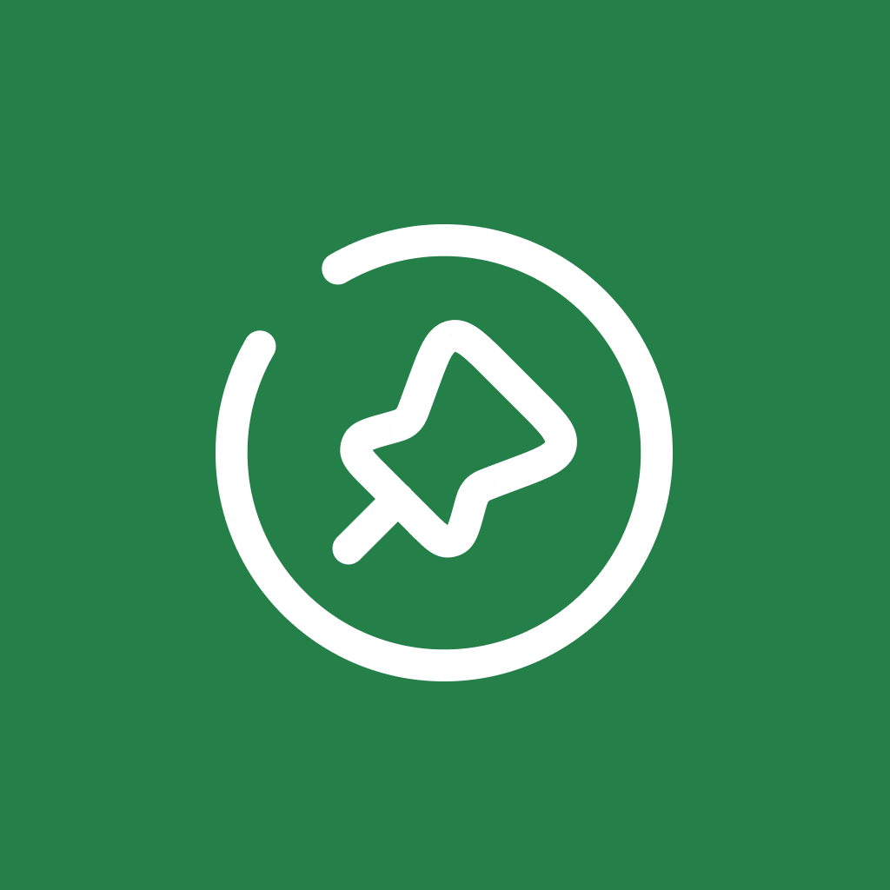

<h1 align="center">
  
</h1>

# Nearby

Nearby é um aplicativo mobile Android de clube de benefícios com cupons para utilizar em estabelecimentos próximos a você.

Projeto desenvolvido durante a NLW - Next Level Week oferecida pela [Rocketseat](https://www.rocketseat.com.br/).

## 🛠 Tecnologias

As seguintes ferramentas foram usadas na construção do projeto:

- [Kotlin](https://kotlinlang.org/)
- [Jetpack](https://developer.android.com/jetpack)
- [Jetpack Compose](https://developer.android.com/compose)
- [Ktor](https://ktor.io/docs/)
- [Google Maps API](https://developers.google.com/maps/documentatio)
- [ZXing](https://github.com/zxing/zxing)
- [Coil](https://coil-kt.github.io/coil/)

## 🎨 Layout

O layout da aplicação está disponível no Figma:

## 📝 Licença

Este projeto está sob a licença MIT.

Feito por Matheus Juan. [Entre em contato](https://www.linkedin.com/in/matheus-ferreira-a84046186/)

  

